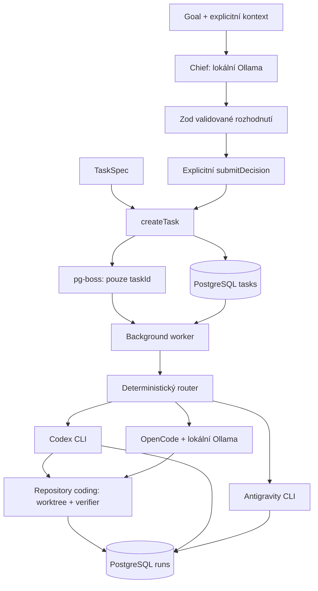

# Architektura a hranice

## Datový tok

Chief je volitelný plánovač bez nástrojů. `src/mastra/index.ts` inicializuje
prázdnou Mastra instanci; není vstupním bodem workeru. Consumer startuje
`src/worker.ts`.

## Persistence a fronta

`public.tasks` drží UUID, TaskSpec pole, nullable repository/chief, stav a časy.
`public.runs` drží UUID, taskId (FK s cascade delete), attempt, worker, tier,
stav, nullable result/workspace/routing/error a časy začátku/konce. Drizzle migrace
jsou v `drizzle/`; queue infrastrukturu spravuje `pg-boss` samostatně.

`createTask()` nejdřív uloží pending row. Po inicializaci queue v jedné DB
transakci provede `boss.send({ taskId })` přes Drizzle adapter a změnu na
queued. Queueing failure ponechá pending task; retry celého volání může
vytvořit duplicitní task.

Fronta je `jonas-os.tasks.execute`, batch size 1, polling 0,5 sekundy,
zpracování batch je serializované. Consumer zamkne task row, založí run
a přepne task na running. Úspěch persistuje v transakci. Výjimka nebo
vrácené success false (včetně nested workerResult) znamená failure.
Completed task se znovu nevykonává. Retry po přerušení uzavře předchozí
running run jako failed. Graceful shutdown čeká až 600000 ms.

`maxAttempts` se nepromítá do send options. Repository coding používá
retryLimit 0, aby selhání verifikace znovu automaticky nevolalo Codex.
Ostatní úkoly mají výchozí queue retry chování. Po tvrdém ukončení repository
coding proto může zůstat running task bez automatické obnovy.

## Executory a worktrees

Router posílá coding na Codex. Non-coding s difficulty >=4 nebo high risk
jede na Antigravity pro, ostatní na flash. Model tieru nastavuje jen
AGY_PRO_MODEL/AGY_FLASH_MODEL; jinak se použije CLI default.

To je výchozí router. Capability router může způsobilý local-coding task
(coding + repository + risk !=high + difficulty v nastaveném limitu) předat
OpenCode po readiness. Jinak před execution zvolí Codex a uloží fallback
reason. Strong-general u non-coding vybere pro, research zachová tier.
Local-utility/independent-review mají zatím původní route s důvodem odkladu.
Kategorie vynucuje kompatibilitu capability. Cloud availability nyní pouze
vrací true; skutečné přihlášení/binárky ověří až execution, nejde o preflight.

Recommendation se ukládá v tasks.chief, worker ji znovu validuje. Worktree
vzniká před readiness, metadata se uloží před write; výběr routy aktualizuje
runs.worker/tier/routing. Worker brief je task data v promptu. Po zahájení
lokálního execution není fallback na jiný provider ani po failure.

Codex volá `exec --json --sandbox … --skip-git-repo-check`, ignoruje stdin
a má timeout 90000 ms. JSONL parser vrací success podle exit code, poslední
agent message, thread ID, usage a stderr. Bez repository je read-only.
Write mode vyžaduje validovaný managed worktree a shodný cwd.

Worktree manager validuje absolutní Git root, lokální base branch (default
main), čistý checkout a nepřítomnost externích Git filtrů. Root musí být
mimo všechny checkouty source repo. Vytvoří branch `jonas-os/task-<UUID>`
a `<root>/<UUID>` bez přepisu existující práce. Git operace nezdědí
GIT_DIR/GIT_WORK_TREE, ignorují global/system config a vypínají hooks
a fsmonitor. Workspace metadata se uloží před startem modelu a worktree
zůstává pro inspekci i po failure.

Workspace-write Codex ignoruje user config i execpolicy rules, má
approval_policy never, žádné další writable roots, vypnutou síť a writable
system tmp. Prompt zakazuje commit, push, merge i úpravy originálního
checkoutu. Instrukce modelu a OS sandbox nejsou obecné zaručení bezpečnosti
libovolného přirozeného požadavku.

Antigravity volá `agy -p … --output-format json --print-timeout 2m`, host
timeout je 120000 ms a stdin ignorovaný. Parsuje JSON, jinak zachová raw
stdout. Wrapper nepřidává `--sandbox`, managed worktree ani verifier;
oprávnění závisí na vlastním nastavení CLI.

### OpenCode

V1 adaptér používá jediný provider ollama a explicitní model, JSONL output,
agent `jonas-local-coding`, max. 12 kroků, výstup 4096 tokenů. Deny-by-default
permissions dovolují repository file tools; shell, external_directory,
network tools, subagents, skills a LSP jsou zakázané. Project/user config,
plugins, MCP, autoupdate a model fetch se nepřebírají. Dočasné HOME/XDG/env
neobsahují host auth ani DATABASE_URL; runtime se uklidí po běhu.

macOS Seatbelt sandbox dovoluje zápisy jen do worktree a runtime, blokuje
zápis worktree .git a povoluje outbound pouze na localhost port Ollama.
Čtení má explicitní systémové/runtime/worktree/Git metadata roots; jde o
konkrétní OS hranice doplněné tool permissions, nikoli plnou anonymizaci
obsahu cílového repozitáře. Adaptér odmítá jiné OS a V2 bez validace jeho schématu.

Timeout je default 180 s, config 1–300 s; parser vyžaduje úspěšný exit,
step_finish stop a veřejnou textovou zprávu. Persistuje session ID, model,
timing a token totals; tool payload/reasoning eventy se nevracejí. Změny
ověří stejný deterministický verifier jako u Codexu a worktree zůstává.

## Verifikace

Manager se určuje z packageManager v package.json, jinak pnpm lock, yarn
lock, pak npm. Nepodporovaný explicitní manager či neplatný manifest je
failure. Chybějící manifest/skripty jsou skips. Checks jsou test, typecheck,
lint, build v tomto pořadí.

Lokální `codex sandbox` sám nevolá AI model. Síť je zakázaná, env izolované,
CI true, stdin ignorovaný. HOME/tmp/cache jsou v čerstvém adresáři uvnitř
worktree; dependencies se neinstalují. Limit je 60 sekund na check,
max. 1 MiB buffer a uložený stdout/stderr max. 64000 znaků. Na Unixu se při
timeoutu, abortu i cleanup ukončí procesní skupina. Při sandbox failure
neexistuje unrestricted fallback.

Výsledek doplní git status, changedFiles, diffStat vůči base commitu a
dirty/truncation flags (max. 1000 cest, 64000 znaků výpisu). Všechny skips
mohou mít aggregate success; čti jednotlivé skipped flags.

## Lokální Chief

Ollama klient akceptuje jen loopback HTTP a lokálně nainstalovaný generation
model bez remote metadat. Readiness requesty mají max. 5 sekund každý.
Generation má konfigurovatelný timeout a používá `/api/chat` s Zod-derived
JSON Schema v format, non-streaming, temperature 0, max. 3072 output tokens,
think false u thinking modelů a keep-alive 5 minut. Další model se záměrně
nenačítá; žádné model downloads.

Ollama 0.32.14 odmítá grammar compilation s velkými string maxLength.
Pouze tyto maxima jsou vynechané z generation formátu a po JSON parse se
vždy vynucují plným Zod schématem. Union/required/enums/minima/array bounds
zůstávají v generation formátu. Viz
[Ollama structured outputs](https://docs.ollama.com/capabilities/structured-outputs).

Invalid/truncated output, tool calls a repository kontext neodvozený ze
vstupu se odmítají typed errors. Není regex recovery ani repair loop.
Submission revaliduje návrh a až pak volá createTask; při queueing failure
může zůstat pending row. Ask_human/no_action nemají persistence side effect.

Prompt žádá otázku při chybějícím kontextu a neschválených destruktivních či
deployment cílech. Schema/grounding validace zaručuje strukturu a repo
parametry, nikoli pravdivost či bezpečnost libovolných instrukcí. Caller
rozhoduje o přijetí návrhu. Capability/workerBrief se vrací v submission
result, ukládají se jako recommendation a předávají workeru. Capability
router rozhodne podle vlastní politiky a provider readiness.

Chief loguje whitelist metadat: model, duration, tokeny pokud jsou
dostupné, success/error code a action. onMetadata dostává stejná data;
jeho výjimka nemění outcome. Thinking traces/prompty se nelogují ani
nepersistují. Vytvořené tasky a worker výsledky se naopak ukládají do DB.

Úplná routing tabulka, runtime limity a aktuální blokovaný stav real OpenCode
smoke jsou v [OpenCode milestone dokumentaci](opencode.md). OpenCode parser a
permission config jsou V1 implementace; konkrétní CLI verze/native discovery
zůstávají bez dostupné binárky neověřené.
