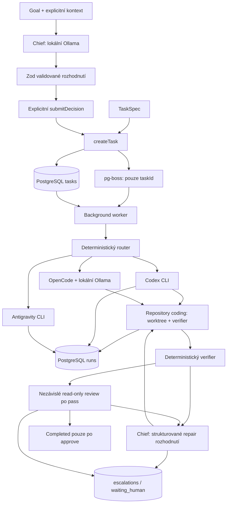

# Architektura a hranice

## Datový tok

Chief je volitelný plánovač bez nástrojů. `src/mastra/index.ts` inicializuje
prázdnou Mastra instanci; není vstupním bodem workeru. Consumer startuje
`src/worker.ts`.

## Persistence a fronta

`public.tasks` drží UUID, TaskSpec pole, nullable repository/chief, stav a časy.
`public.runs` drží UUID, taskId (FK s cascade delete), attempt, worker, tier,
stav, nullable result/workspace/routing/error a časy začátku/konce. Drizzle migrace
jsou v `drizzle/`; queue infrastrukturu spravuje `pg-boss` samostatně.

`createTask()` nejdřív validuje TaskSpec a normalizuje sémantiku, potom uloží pending row. Po inicializaci queue v jedné DB
transakci provede `boss.send({ taskId })` přes Drizzle adapter a změnu na
queued. Queueing failure ponechá pending task; retry celého volání může
vytvořit duplicitní task.

Fronta je `jonas-os.tasks.execute`, batch size 1, polling 0,5 sekundy.
Repository coding přebírá durable `orchestrateCodingTask()`: session advisory
lock na task, vlastní run na každý pokus, checks, Chief rozhodnutí a review.
TaskSpec.maxAttempts se omezí globálním capem (default 3), nikoli queue retry.
Repository jobs mají retryLimit 0 a expiration 3600 s. Waiting_human/completed
se durable vypořádají bez throw; pg-boss completed není task verdict.

`tasks.queueName` zachová frontu pro resume. `tasks.orchestration` drží fázi,
latestRunId, Chief decision a recommendation. `runs.parentRunId/failureKind`
zaznamenají původ opravy a typ selhání. `reviews` má unique runId, reviewer,
providerFamily/model, status, strukturovaný verdict/findings a časy.
`escalations` drží otázku/kontext/odpověď a open/resolved/cancelled; lightweight
`orchestration_events` drží přechody bez event-sourcing frameworku.

Lidská odpověď, resolved, queued a ID-only enqueue proběhnou atomicky. Chief
odpověď interpretuje před dalším workerem; limit ani worktree se neresetují.
Startup consumeru obnoví bezpečné checkpointy své queue. Executing/deciding/
reviewing bez vlastníka jsou nejasná volání: eskalace bez automatické duplicity.
Ztráta lock spojení abortuje nová volání. Externí provider může přežít tvrdý
crash; před resume musí člověk ověřit jeho ukončení. Recovery není globální cleanup.

Non-repository execution zachovává původní row-lock/run a queue retry chování.
Graceful shutdown nadále čeká nejvýše 600000 ms.
[Úplný state machine, opravy, schema a quota safety](repair-loop.md).

## Executory a worktrees

Router posílá coding na Codex. Non-coding s difficulty >=4 nebo high risk
jede na Antigravity pro, ostatní na flash. Model tieru nastavuje jen
AGY_PRO_MODEL/AGY_FLASH_MODEL; jinak se použije CLI default.

To je výchozí router. Capability router může způsobilý local-coding task
(coding + repository + risk !=high + difficulty v nastaveném limitu) předat
OpenCode po readiness. Jinak před execution zvolí Codex a uloží fallback
reason. Strong-general u non-coding vybere pro, research zachová tier.
Local-utility/independent-review mají zatím původní route s důvodem odkladu.
Centrální `src/tasks/semantics.ts` se používá po Chief parsing/submission,
před DB insertem, při čtení DB rows, category/capability routování a na vstupu
executoru. `local-coding`/`strong-coding` vynucují coding s repository; chybějící
repository se odmítá. Úzká kontrola explicitní anglické mutation instrukce v
objective/kritériích vynutí coding i u non-coding capability. Repository sám
neopravňuje zápis; research/planning bez mutation instrukcí zůstávají general.
Fronta a recovery normalizují i staré konfliktní aktivní rows před volbou
pipeline; staré coding rows bez repository bezpečně selžou. Coding pipeline
má přednost před non-coding capability. Cloud availability nyní pouze
vrací true; skutečné přihlášení/binárky ověří až execution, nejde o preflight.

Recommendation se ukládá v tasks.chief, worker ji znovu validuje. Worktree
vzniká před readiness, metadata se uloží před write; výběr routy aktualizuje
runs.worker/tier/routing. Worker brief je task data v promptu. Po zahájení
execution není fallback uvnitř stejné invocation. Chief může po uloženém
selhání autorizovat nový pokus s jiným workerem ve stejném worktree.

Codex volá `exec --json --sandbox … --skip-git-repo-check`, ignoruje stdin
a má timeout 90000 ms. JSONL parser vrací success podle exit code, poslední
agent message, thread ID, usage a stderr. Přímý adapter `runCodex()` má také
read-only režim; TaskSpec coding bez repository se do execution nepustí.
Write mode vyžaduje validovaný managed worktree a shodný cwd.

Worktree manager validuje absolutní Git root, lokální base branch (default
main), čistý checkout a nepřítomnost externích Git filtrů. Root musí být
mimo všechny checkouty source repo. Vytvoří branch `jonas-os/task-<UUID>`
a `<root>/<UUID>` bez přepisu existující práce. Git operace nezdědí
GIT_DIR/GIT_WORK_TREE, ignorují global/system config a vypínají hooks
a fsmonitor. Workspace metadata se uloží před startem modelu a worktree
zůstává pro inspekci i po failure.

Workspace-write Codex ignoruje user config i execpolicy rules, má
approval_policy never, žádné další writable roots, vypnutou síť a writable
system tmp. Prompt zakazuje commit, push, merge i úpravy originálního
checkoutu. Instrukce modelu a OS sandbox nejsou obecné zaručení bezpečnosti
libovolného přirozeného požadavku.

Antigravity volá `agy -p … --output-format json --print-timeout 2m`, host
timeout je 120000 ms a stdin ignorovaný. Parsuje JSON, jinak zachová raw
stdout. Wrapper nepřidává `--sandbox`, managed worktree ani verifier;
oprávnění závisí na vlastním nastavení CLI.

### OpenCode

Adaptér používá jediný provider ollama a explicitní model, preferovaný JSONL output,
agent `jonas-local-coding`, max. 12 kroků, výstup 4096 tokenů. Deny-by-default
permissions dovolují repository file tools; shell, external_directory,
network tools, subagents, skills a LSP jsou zakázané. Project/user config,
plugins, MCP, autoupdate a model fetch se nepřebírají. Dočasné HOME/XDG/env
neobsahují host auth ani DATABASE_URL; runtime se uklidí po běhu.

macOS Seatbelt sandbox dovoluje zápisy jen do worktree a runtime, blokuje
zápis worktree .git a povoluje outbound pouze na localhost port Ollama.
Čtení má explicitní systémové/runtime/worktree/Git metadata roots; jde o
konkrétní OS hranice doplněné tool permissions, nikoli plnou anonymizaci
obsahu cílového repozitáře. Bun/ICU potřebuje také read-only system timezone data.
Adaptér odmítá jiné OS a CLI, která nezachová požadovaný resolved config.

Timeout je default 180 s, config 1–300 s; parser vyžaduje úspěšný exit,
step_finish stop a veřejnou textovou zprávu. Persistuje session ID, model,
timing a token totals; tool payload/reasoning eventy se nevracejí. Text fallback
vyžaduje exit 0 a neprázdný výstup do 64 kB, session/usage jsou null. Změny
ověří stejný deterministický verifier jako u Codexu a worktree zůstává.

## Verifikace

Manager se určuje z packageManager v package.json, jinak pnpm lock, yarn
lock, pak npm. Nepodporovaný explicitní manager či neplatný manifest je
failure. Chybějící manifest/skripty jsou skips. Checks jsou test, typecheck,
lint, build v tomto pořadí.

Lokální `codex sandbox` sám nevolá AI model. Síť je zakázaná, env izolované,
CI true, stdin ignorovaný. HOME/tmp/cache jsou v čerstvém adresáři uvnitř
worktree; dependencies se neinstalují. Limit je 60 sekund na check,
max. 1 MiB buffer a uložený stdout/stderr max. 64000 znaků. Na Unixu se při
timeoutu, abortu i cleanup ukončí procesní skupina. Při sandbox failure
neexistuje unrestricted fallback.

Výsledek doplní git status, changedFiles, diffStat vůči base commitu a
dirty/truncation flags (max. 1000 cest, 64000 znaků výpisu). Všechny skips
mohou mít aggregate success; čti jednotlivé skipped flags.

## Lokální Chief

Ollama klient akceptuje jen loopback HTTP a lokálně nainstalovaný generation
model bez remote metadat. Readiness requesty mají max. 5 sekund každý.
Generation má konfigurovatelný timeout a používá `/api/chat` s Zod-derived
JSON Schema v format, non-streaming, temperature 0, max. 3072 output tokens,
think false u thinking modelů a keep-alive 5 minut. Další model se záměrně
nenačítá; žádné model downloads.

Ollama 0.32.14 odmítá grammar compilation s velkými string maxLength.
Pouze tyto maxima jsou vynechané z generation formátu a po JSON parse se
vždy vynucují plným Zod schématem. Union/required/enums/minima/array bounds
zůstávají v generation formátu. Viz
[Ollama structured outputs](https://docs.ollama.com/capabilities/structured-outputs).

Invalid/truncated output, tool calls a repository kontext neodvozený ze
vstupu se odmítají typed errors. Plánovací výstup nemá regex recovery ani automatickou opravu.
Repair rozhodování je samostatná schopnost `src/chief/repair.ts`, nikoli změna planGoal().
Submission revaliduje návrh a až pak volá createTask; při queueing failure
může zůstat pending row. Ask_human/no_action nemají persistence side effect.

Prompt žádá otázku při chybějícím kontextu a neschválených destruktivních či
deployment cílech. Schema/grounding validace zaručuje strukturu a repo
parametry, nikoli pravdivost či bezpečnost libovolných instrukcí. Caller
rozhoduje o přijetí návrhu. Capability/workerBrief se vrací v submission
result, ukládají se jako recommendation a předávají workeru. Capability
router rozhodne podle vlastní politiky a provider readiness.

Chief loguje whitelist metadat: model, duration, tokeny pokud jsou
dostupné, success/error code a action. onMetadata dostává stejná data;
jeho výjimka nemění outcome. Thinking traces/prompty se nelogují ani
nepersistují. Vytvořené tasky a worker výsledky se naopak ukládají do DB.

Úplná routing tabulka, runtime limity a stav skutečného OpenCode smoke jsou v
[OpenCode milestone dokumentaci](opencode.md). CLI compatibility se ověřuje
podle capabilities a zachování config/permissions; JSON je preferovaný,
custom agent lze vybrat flagem nebo ověřeným `default_agent`.

## Nezávislé read-only review

Policy vybírá Antigravity pro OpenCode/Qwen i Codex; Codex fallback smí
hodnotit pouze OpenCode. Provider family nesmí být stejná jako u autora.
Reviewer dostává bounded/redigovaný snapshot včetně nových souborů, nikoli
write-capable coding prompt. Neúplný snapshot eskaluje ještě před modelem.

Nový snapshot reviewer wrapper sdílí boundedProcess/readiness infrastrukturu.
Izolované HOME + auth-only kopie, prázdná config/MCP a macOS Seatbelt vynucují
read-only mimo disposable runtime; další executable jsou zakázané. Nemá
přímý přístup do task/source worktree. Cloud network slouží inference.
Antigravity plan/sandbox/JSON schema a Codex read-only/ignore config jsou
code-owned. Původní obecný Antigravity execution wrapper se nemění.

Request_changes jde do Chief. High/critical návrh opravy zastaví člověk;
po jeho odpovědi Chief rozhoduje znovu a TypeScript vynutí strong-coding.
Approve může dokončit task jen s worker success a úspěšnými checks. Reviewer
nemůže schválit selhání verifieru. Zod review schema vlastní konzistenci
verdict/severity/findings/otázky; DB uchovává concise veřejné findings bez traces.

## Lokální Control Plane

`apps/control-plane` je samostatný Next App Router workspace. Server components
čtou Zod DTO z `src/control-plane`; bulk last-run lookup a bounded SQL projekce
oddělují seznamy od logů. Task/run/review/escalation/events schema se nemění.
UI mutations pouze validují lokální HTTP vstup a volají planGoal/submitDecision,
answerEscalation a abandonTask. Transaction a status transitions nadále vlastní
engine. Browser nikdy neurčuje workspace filesystem path, shell ani status.

Readiness běží bez inference v coalesced 20s procesní cache. Cloud binary
presence je unknown, nikoli důkaz auth. Routes se obnovují pollingem 4/15s
podle activity a browser visibility. Projects jsou hash normalizovaného
repository.path. Minimální `repositories` registry ukládá UUID, name, canonical
path (unique), createdAt a updatedAt; migrace `0004_loving_pretty_boy.sql`.
Nemá roadmap ani semantic memory. Registration validuje Git root serverově;
delegace přijímá pouze key registrované a znovu ověřené cesty. Historické
cesty jsou read-only skupiny do registrace. `JONAS_OS_REPOSITORIES` zajišťuje
explicitní bootstrap bez hledání adresářů. Host/Origin kontrola,
loopback binding, strict body schema, bounded/redacted plain text a request-ID
cache vymezují lokální bezpečnostní hranici. [Detailní kontrakty a limity](control-plane.md).

Final Result je čistá projekce existující `runs.result.workerResult.message`,
Git/verification metadata a review vázaného na stejný run. Primární report
pochází z posledního úspěšného coding workeru, u legacy dat z completed runu.
SQL omezuje payload a ponechává skutečný počet uložených changedFiles.
Worker prompty žádají operátorský report také při opravách; parser jeho
formát nevyžaduje. Žádná inference navíc ani změna completion policy.

## Invariant dokončení repository coding

Obě místa zapisující task `completed` (general queue a durable `saveState`)
volají `assertTaskCompletion()` pod task row lockem v téže transakci. Guard
znovu načte sémantiku a právě poslední attempt; starší úspěch nestačí.
`assertCodingCompletion()` vyžaduje coding worker, skutečný start, execution success, uložená metadata worktree shodná s výsledkem a taskem,
Git changedFiles metadata, úspěšný neprázdný verifier result a nezávislý
completed review s APPROVE pro stejné taskId/runId. Worktree se ještě ověří
proti Git a canonical repository cestě. Skipped checks zůstávají podle
stávající verifier policy explicitně zaznamenané; guard je nevydává za provedené.
Chybějící důkazy nemohou přepsat task na completed: durable cesta eskaluje
`waiting_human`, general shortcut selže. Control Plane zobrazí skutečný stav
a důvod `Execution incomplete: repository mutation was not verified.`
Historické completed rows se automaticky nepřepisují ani znovu nevykonávají;
jejich chybějící evidence zůstává viditelná a vyžaduje operátorský audit.
Final Result navíc pro historický repository coding zobrazí explicitní invariant
warning při chybějících důkazech nebo novějším neúspěšném pokusu; uložený stav nepřepisuje.

Verifier má vlastní krátký runtime `/tmp/jo-v-<náhodný suffix>` (na macOS
canonical `/private/tmp/…`), atomicky vytvořený s právy 0700. `TMPDIR`, `TMP`,
`TEMP`, HOME a npm cache míří pouze do něj. Cwd zůstává worktree; launcher
povolí zápisy a AF_UNIX IPC jen v tomto runtime a zachová zakázanou síť
a obecný `/tmp`. Worker tuto výjimku nedostává. Runtime má limit 40 bajtů
a cleanup kontroluje canonical cestu, inode, device a vlastníka.
