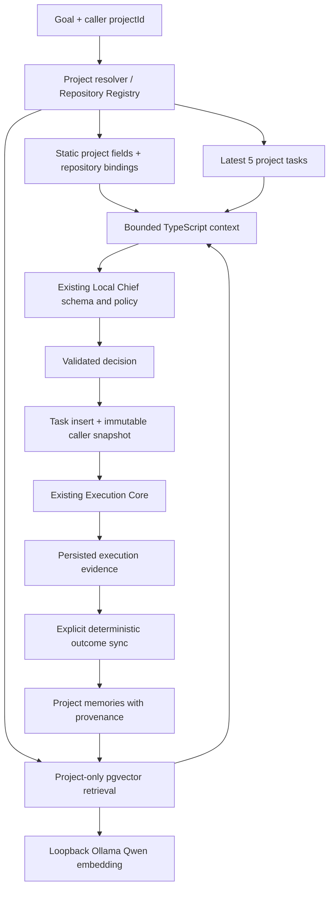

# Project Model + Semantic Memory V1 — report

Ověřeno 2. října 2026 na macOS, proti místní vývojové databázi. Milestone
implementuje persistentní projekty, lokální sémantickou paměť a kontext před
Chief plánováním. Autonomous Next-Step Planning není implementován.

## Architektura a hranice změny



Implementace je rozdělena mezi `src/projects` (contracts, store, context,
submission) a `src/memory` (embedding, retrieval, explicit outcome sync, CLI).
Memory je data, nikoli autorita. Chief dostává pouze bounded rendered context,
žádné DB tools. TaskSpec, Chief schema/prompt, normalization, router, sandbox,
workers, verifier, repair, reviewer, escalation a completion invariant se
nemění. `createTask` přidává pouze volitelnou caller metadata cestu při insertu;
původní repository-only cesta a queue/pending diagnostika zůstávají stejné.
Embedding adapter není volán z completion transakce.

## Databáze a bezpečný upgrade

Migrace `drizzle/0005_overconfident_gladiator.sql` a odpovídající Drizzle
snapshot/journal přidávají:

- `CREATE EXTENSION IF NOT EXISTS vector`;
- `projects`, `project_repositories`, `project_memories`;
- nullable `tasks.project_id` a `tasks.project_context`;
- unique/check/FK/index constraints a immutable task association trigger.

Compose přešel z `postgres:16` na `pgvector/pgvector:0.8.6-pg16-trixie`,
se zachovaným PostgreSQL major **16** a existujícím volume **jonas-os_jonas_pg**.
Před změnou byl vytvořen custom-format `pg_dump` (70 342 bytes) mimo Git,
`before-pgvector.dump` v Codex backup adresáři tohoto milestone. Žádný reset,
`down -v`, mazání volume ani backfill historických tasks neproběhl. Původní
image používal Trixie; varianta pgvector pro Trixie zachovává collation runtime.
Krátký preflight pokus s Bookworm image vyvolal collation warning a byl
nahrazen odpovídající Trixie variantou před migrací.

Výsledný runtime: **PostgreSQL 16.15**, **pgvector 0.8.6**, sloupec
**vector(1024)**. Migrace byla aplikována na původní DB; následný `db:generate`
nenachází schema drift.

Před a po celém ověření jsou původní data shodná. MD5 je diagnostický otisk
`row_to_json` řádků v ID pořadí; u tasks se porovnávají původní sloupce.

| Tabulka | Počet před / po | Shodný otisk před / po |
| --- | --- | --- |
| tasks | 7 / 7 | `c7b17348d5f84f989fc138d09435436d` |
| runs | 7 / 7 | `85b397fbec2970282d81d27b88b7a31c` |
| reviews | 2 / 2 | `5ebe578f0de6d314c1b8cd50a71f4a83` |
| escalations | 4 / 4 | `724ce9abc97612739cdebfc817b316d9` |
| repositories | 1 / 1 | `1fabf860b5ffcaaead6889d6ef68de01` |

Všech 7 historických tasks má `project_id` i `project_context` NULL. Po cleanup
je počet projects, project_repositories a project_memories **0**; nový projekt
je funkce pro uživatele, nikoli zanechaný demo fixture.

## Schémata projektu, vazeb a paměti

Project: UUID, unique stabilní slug, name, description, status
`active/paused/archived`, currentMilestone, goals, constraints, instructions,
createdAt/updatedAt. Limity: name 200, slug 100, description 2000, milestone
1000, každé goals/constraints/instructions 3000 znaků.

Vazba: projectId + existující Registry repositoryId, nullable role (100),
isPrimary, createdAt. Pair unique a partial primary unique dovolují repo ve
více projektech a nejvýše jeden primary na projekt. Max. 20 vazeb v API.
Registry nadále vlastní filesystem identity a validaci. Žádná cesta nevstupuje
přes project API. Výběr/primary/jediná vazba se vyřeší v TypeScriptu; více vazeb
bez výběru/primary nebo chybějící vazba vrátí `ask_human`.

Memory: UUID, jeden projectId, kind, nullable title, content, importance,
sourceType/sourceId/sourceMetadata, contentHash, nullable embedding/model,
embeddingError, createdAt/updatedAt/archivedAt. Typy: fact, decision, milestone,
issue, architecture, outcome. Content max. 8000, title 200, importance integer
0–5; metadata JSON max. 2000 znaků. SourceType je vždy explicitní:
manual/task/run/review/task_outcome_sync/import. Ne-manual musí mít sourceId.
Browser nepřijímá source authority; manual metadata doplňuje server.

Durable duplicita: project + sourceType + SHA-256(kind, title, content,
sourceId); navíc task_outcome_sync unique project + sourceId. Archivovaná
manual duplicita se znovu tiše neaktivuje. Manual archive vyřadí obsah ze
search/list, zachová snapshot reference. Task-derived memory nelze touto
akcí smazat. Project DELETE s existujícími tasks je RESTRICT, bez nich
CASCADE na vazby/paměti. Repository DELETE s vazbou je RESTRICT. Veřejné
project DELETE API není; uživatel mění status na archived.

## Embedding, retrieval a kontext

Adapter používá **qwen3-embedding:0.6b** přes lokální Ollama HTTP na loopback.
Konfigurace: MEMORY_EMBEDDING_MODEL, MEMORY_EMBEDDING_TIMEOUT_MS (default
30000 ms, rozsah 50–120000), existující OLLAMA_BASE_URL. Odmítá remote URL,
credentials/path/query, redirects, cloud model/remote metadata a chybějící
embedding capability. Readiness tags/show neprovádí inference ani download.
Vstup max. 8201 znaků, response max. 512 KB, `truncate:false`; query má
instruction prefix. Strukturované error codes rozlišují configuration,
offline, timeout, model_missing, remote_model, dimension, bad_response, http.

Actual dimension **1024** byla ověřena v `/api/show` i reálném `/api/embed`
výstupu; odpovídá centrální konstantě a DB. Každý vektor musí mít 1024 finite
hodnot a být nonzero; žádné doplnění ani seříznutí. Uložený model je jméno
s digestem, aby se nemíchaly embedding spaces.

SQL před výběrem filtruje projectId, archive, indexaci a model digest;
TypeScript filtr projectId opakuje. Přesná cosine query vybere max. 30
kandidátů; similarity <0.2 se nevrací, max. 8 výsledků. Hybrid score:

```text
0.90 × cosine_similarity + 0.07 × importance/5 + 0.03/(1 + age_days/30)
```

Shody řeší similarity, createdAt DESC, ID ASC. Boosts dohromady max. 0.10;
nová irelevantní paměť nepřebije výrazně relevantnější staré rozhodnutí.

Chief context: static fields + bindings do 3000 znaků, selected memories
celkem do 2500 (content max. 800 na položku), max. 5 recent task titles/statuses;
celkový rendered limit 6400. Statická pole v promptu max. 450 znaků, name 200.
Existující Chief input JSON limit zůstává 16000, goal max. 4000. Embeddings,
logs a hidden reasoning se nevykreslují. Embedding failure explicitně označí
retrieval unavailable a použije static/recent kontext; DB chyby se nezamlčí.

Caller dodává projectId mimo model-controlled TaskSpec. Po plánování se
atomicky s task insertem ověří aktivní projekt, verze updatedAt, binding/path
a vlastnictví vybraných memory/task IDs. Snapshot zaznamená projectId,
projectUpdatedAt, memoryIds, recentTaskIds, repository binding, retrievalQuery,
retrievalStatus, createdAt. DB JSON limit 12000 a trigger zakazují pozdější
změnu association/snapshot. Task detail vysvětluje „Why Chief knew this“.

## Deterministický sync a Control Plane

Sync zpracuje explicitně max. 50 completed tasks v ID pořadí, další dávka má
cursor. Projektuje title, objective, bounded changed files, verifier statuses,
reviewer verdict, public worker summary a source IDs. Chybějící historické
metadata jsou `(not recorded)`. Failed/unfinished tasks se neprojektují.
Rerun nevytváří duplicity, zkouší chybějící indexaci. Výsledek obsahuje scanned,
created, alreadyExisted, embeddingFailures, skipped, nextCursor. Žádné LLM
summary, task mutation, completion hook ani sync při page load.

Control Plane zachovává původní vizuální jazyk. `/projects` zobrazuje skutečné
projekty a jejich CRUD, bindings, recent activity. `/repositories` zachovává
Registry; původní repository detail URL `/projects/<24hex>` přesměruje na nové
místo. Detail má memory list/pagination, manual create/archive, source metadata,
semantic debug search se scores, explicit sync a retry indexace. Overview
vybírá projekt a jen jeho bound repositories; bez projektu funguje původní
repository-only delegace. Historické tasks s NULL association se renderují.

Nové endpoints používají původní Host/Origin protections, strict Zod, UUID,
délkové limity a X-Request-ID mutation gate. DB constraints doplňují process
idempotency. DTO nikdy nevybírají vector; veřejná metadata/text mají redakci
rozpoznaných secrets. Memory nemůže obejít bezpečnostní ani capability policy.

Mobilní QA odhalilo roztažení gridu kvůli delší navigaci; mobile sloupec používá
`minmax(0,1fr)` a sidebar min-width 0, navigace lokálně scrolluje. Tailwind v4
má explicitní source adresáře, aby generované `.next` nezpůsobovalo opakované
HMR a chyby hydration v izolovaném checkoutu.

## Testy a výsledky

Nové pure testy (`src/projects/projects.test.ts`, `src/memory/embedding.test.ts`)
mají **15/15 PASS**: strict schemas/provenance/hash, ranking/isolation/ties,
bounded context, repo defaulting, fake Chief, degradation, caller snapshot,
public deterministic projection, Host/Origin/UUID API security; embeddings
readiness, dimensions, unavailable, timeout, remote/redirect/input/output limits.

Real DB suite `src/projects/db-integration.ts` testuje CRUD/archive/slug,
transactional bindings/primary, duplicate memories, embedding recovery,
project isolation, real pgvector insert/query, FK semantics, immutable snapshot,
actual createTask association do vlastní queue bez consumeru, legacy tasks,
completed/partial/failed outcomes, idempotent sync a project API. Používá fake
embeddings, vytvoří a odstraní pouze vlastní data a ověří původní otisky.

| Ověření | Výsledek |
| --- | --- |
| npm run typecheck | PASS |
| npm test (včetně memory:test) | PASS, bez Ollama/cloud dependency |
| npm run reviewer:test | PASS, 11 testů, fake CLI + OS sandbox |
| npm run orchestration:test | PASS, 23 testů, fake providers + DB/OS |
| npm run db:test | PASS |
| npm run queue:test | PASS |
| npm run worktree:test | PASS, fake workers/verifier fixtures |
| npm run control-plane:db:test | PASS, 3000 fixture tasks, cleanup |
| npm run memory:db:test | PASS, včetně závěrečného opakování |
| npm run memory:check | PASS, inference=false, DB vector(1024), model dimension=1024 |
| npm run memory:smoke | PASS, jedna malá lokální smoke sada |
| npm run control-plane:typecheck | PASS |
| npm run control-plane:lint | PASS |
| npm run control-plane:build | PASS, production routes sestaveny |
| npm run control-plane:e2e | PASS, 2 browser testy s fake Chief |
| npm run memory:browser:test | PASS, real DB + local embedding + fake Chief |
| npm run db:generate | PASS, no schema changes |
| git diff --check | PASS |

Žádná skutečná Codex/Antigravity/Chief coding inference ani coding E2E nebyla
spuštěna. Reviewer/orchestration/worktree fixtures volají fake CLI, nikoli AI
providery. Browser QA používá explicitní development-only
CONTROL_PLANE_PROJECT_QA=1, v production zakázaný. Skutečné modelové calls byly
výhradně místní embedding smoke a embedding funkce browser memory QA.

Reálný pgvector test: **vector_dims=1024, cosine distance stejného vektoru=0**.
První outcome sync: scanned=2, created=2, alreadyExisted=0, embeddingFailures=0.
Druhý: scanned=2, created=0, alreadyExisted=2, embeddingFailures=0.

Real embedding smoke query „market data architecture“:

| Memory | Cosine similarity (orientační) | Pořadí |
| --- | --- | --- |
| MarketDataService is server-only | 0.4619 | 1 |
| Historical chart uses split-adjusted close | 0.3138 | 2 |
| User prefers dark mode | 0.1506 | 3 |

Dimenze 1024, model digest
`ac6da0dfba84a81fdbfbaf330198c33cd77c4cdfc53e8bc50eb581914a15621d`.
Test nevyžaduje brittle exact scores, pouze relativní pořadí.

Browser QA vytvořilo dočasný Git repo přes Registry UI, projekt s primary,
upravilo milestone, uložilo/indexovalo manual memory, zobrazilo source a search
scores, ověřilo mobile overflow, sync prázdné historie, project i legacy
repository-only goal, hostile Origin 403 a manual archive. Task count zůstal
7; temporary project/repository byly odstraněny, page errors=0. Finální běh
1/1 PASS (14.2 s); starší selhání odhalila a pomohla opravit layout/HMR a
nepřesné test selectors, nejsou zde vydávána za úspěšná.

Screenshoty skutečného project QA:

- [Projects desktop](project-memory-v1/projects-desktop.png)
- [Project memory desktop](project-memory-v1/project-memory-desktop.png)
- [Project memory mobile, 390 px](project-memory-v1/project-memory-mobile.png)
- [Project delegation](project-memory-v1/project-delegation.png)

Aktualizované původní screenshoty v `docs/control-plane/` zachycují novou
navigaci a backward-compatible fixture workflow, desktop/laptop/mobile/dark.

## Upgrade a omezení

Úplné spustitelné příkazy, API tabulky, setup a troubleshooting jsou v
[project-memory.md](project-memory.md), [setup.md](setup.md) a
[troubleshooting.md](troubleshooting.md). Z kořene checkoutu:

```sh
npm ci
# Nejprve ověř původní PG major/volume a vytvoř pg_dump zálohu dle setupu.
docker compose -p jonas-os pull postgres
docker compose -p jonas-os up -d postgres
npm run db:migrate
npm run memory:check
# Pouze pokud model chybí a chceš jej stáhnout:
ollama pull qwen3-embedding:0.6b
# Explicitní akce pro existující project UUID:
npm run memory:sync -- <project-UUID>
npm run memory:index -- <project-UUID>
```

Použij původní Compose project name, pokud se liší; nevytvářej náhradní prázdné
volume. Na jiném OS image ověř collation kompatibilitu. Služby během výměny
zastav. Proměnné jsou zdokumentované i v `.env.example`.

V1 neukládá full prompt ani historický obsah všech static polí; snapshot je
provenance/reference, nikoli garantovaný exact replay. Nemá bulk reindex po
změně embedding digestu, lexical/approximate search, inline memory edit, hard
project delete, import UI ani automatické memories. Inventář má limit 100
projektů, paměti listují po 50, sync/index jsou dávkované. Role lze nastavit
API, editor spravuje členství a primary. Nedostupná indexace může snížit
sémantický kontext; task completion na ní nezávisí. Neproběhl soak/load test
velkého memory korpusu ani nová real coding E2E; ty nebyly součástí scope.

## Změněné soubory a Git

Změny zahrnují:

- `src/projects/*`, `src/memory/*`, `src/control-plane/project-api.ts` a
  `project-qa.ts`: domain, persistence, retrieval, context, CLI/tests/API/QA.
- `src/db/schema.ts`, `drizzle/0005_*`, `drizzle/meta/_journal.json`,
  `docker-compose.yml`: migrace a PG16 pgvector setup.
- `src/tasks/create-task.ts`, `src/chief/submit-decision.ts`: volitelná caller
  association; odpovídající existující test fixtures v chief/tasks tests.
- `src/control-plane/{contracts,queries,mapping,mutations,security,fixtures}.ts`:
  project association DTO/query/delegation, žádná změna execution policy.
- `apps/control-plane/app/api/projects/*`, `app/projects/*`, `app/repositories/*`,
  `app/{layout,page,tasks/page}.tsx`, `app/globals.css`,
  `components/{commands,live,navigation,primitives,task-detail,project-editor}.tsx`,
  `lib/server.ts`, Playwright configs a e2e specs: UI a browser regrese.
- `.env.example`, `package.json`, README, setup/usage/architecture/development/
  troubleshooting/control-plane docs, project-memory docs a QA screenshoty.

`package-lock.json` zůstává beze změny; žádné credentials, `.env`, `.mastra`,
node_modules nebo backup nebyly přidány do Git. Přesný seznam je dostupný
přes `git diff --name-status e92d04d69436562c4784c0fa75130e807475ef50..codex/project-memory-v1`.

Branch: **codex/project-memory-v1**, založený na ověřeném
**e92d04d69436562c4784c0fa75130e807475ef50**. Implementace a report jsou commitovány
na tuto větev a pushnuty do origin, bez merge do main. Ověřený implementační
commit: **d73d13cf67171c4bd833bc988d96ef3231f96a1d**. Finální delivery SHA (zahrnuje tento
report) zjistí `git rev-parse codex/project-memory-v1` a závěrečný výstup.
Vložit vlastní finální commit hash do jeho vlastního obsahu není možné bez
změny hashe.

Původní checkout `/Users/jonas/jonas-os` má stále jedinou původní změnu
` M AGENTS.md`. `main == origin/main == e92d04d69436562c4784c0fa75130e807475ef50`.
SHA-256 AGENTS.md před/po:
`cb7f056226669cf21c040d7c2d8f14f70c51dbb3ae191b4458dac4de0b49ca60`.
Nebyl upraven, stashován ani commitován; práce probíhala v samostatném
worktree `project-memory-v1/jonas-os`. Cizí worktrees/branches se neuklízely.
